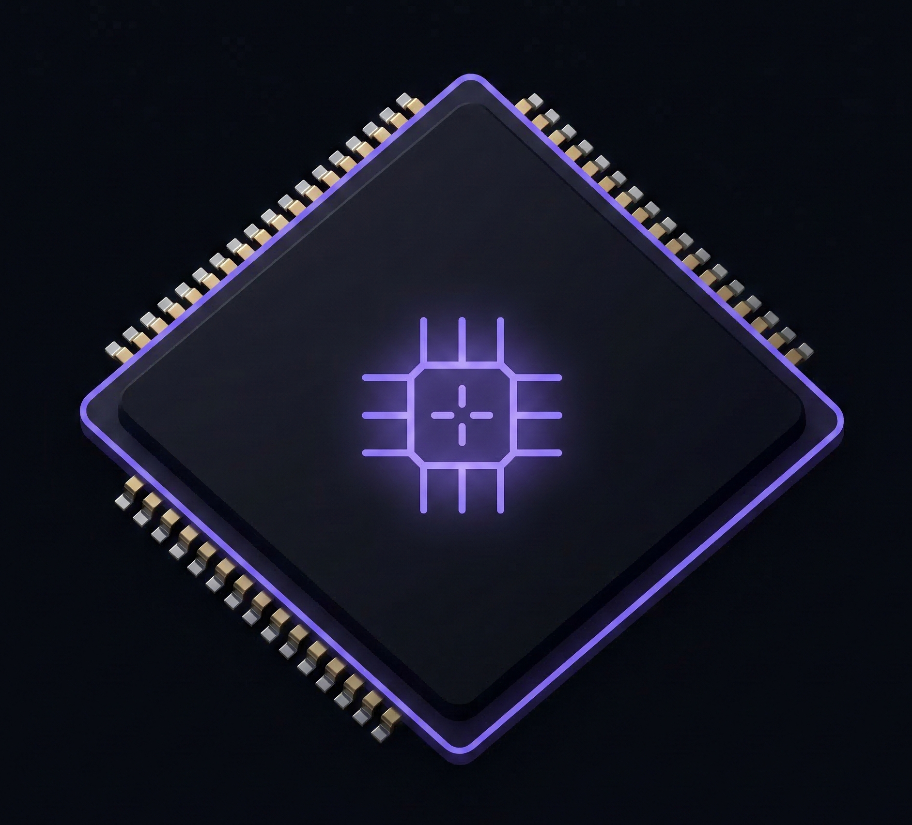

<div align="center">



# WillItRun

### Will your GPU run this AI model? Find out in seconds.

**WillItRun instantly tells you which local AI models your GPU can run — with real context window sizes and generation speed estimates.**

<br />

[](https://github.com/yashveermehta/willitrun/actions/workflows/deploy.yml)
[](https://github.com/yashveermehta/willitrun/actions/workflows/update-data.yml)
[](LICENSE)
[](#)
[](#)
[](https://kit.svelte.dev)

<br />


<br />

</div>

---

## What is WillItRun?

Running AI models locally is powerful — but figuring out *which* model actually fits on your GPU is confusing. Model cards list parameters, not memory requirements. VRAM calculators are scattered and outdated.

WillItRun solves this. Select your GPU, set your filters, and instantly see every compatible model with three numbers that actually matter:

- **Weight size** — how much VRAM the model occupies
- **Max context** — the longest conversation or document it can handle on your hardware  
- **Tokens/sec** — how fast it will generate, estimated from real memory bandwidth benchmarks

No sign-up. No server. No tracking. Runs entirely in your browser.

---

## Features

- **71 GPUs** across NVIDIA, AMD, and Apple Silicon — all with verified VRAM and bandwidth specs
- **27 model entries** covering 17 families — Llama, Qwen, DeepSeek, Mistral, Phi, Gemma, Mixtral and more
- **Instant results** — three buckets updated live: Runs Well, Tight Fit, Won't Fit
- **Smart filters** — minimum context window (2K → 200K) and minimum speed (5 → 100 tok/s)
- **System RAM offloading** — enter your RAM to unlock larger models via memory offloading
- **Speed estimates** — calibrated against real hardware benchmarks, ±5% accuracy for 2–9 GB models
- **Auto-updating data** — GitHub Actions fetches new GPUs and models every Sunday and redeploys automatically
- **Compare page** — side-by-side GPU comparison
- **Bench page** — explore real benchmark data
- **Fully static** — builds to pure HTML/JS/CSS, deploys to GitHub Pages or any CDN for free

---

## How the algorithm works

LLM memory usage has two components: model weights and the KV cache.

```
total_vram = weight_gb + (kv_per_1k_gb × context_length_k)
```

**Maximum context** your VRAM can support for a given model:

```
available_for_kv = your_vram_gb - model.weight_gb
max_context_k    = floor(available_for_kv / model.kv_per_1k_gb)
                   capped at model's trained context limit
```

**Estimated generation speed** (token generation is memory-bandwidth bound):

```
tok/s ≈ memory_bandwidth_gbps / (weight_gb + 1.0)
```

The `+1.0 GB` overhead accounts for KV cache reads, intermediate activations, and inference engine overhead — calibrated against real benchmarks, achieving under 5% error on models between 2 GB and 9 GB.

**Result bucketing:**

| Bucket | Condition |
|--------|-----------|
| ✅ Runs well | Fits in VRAM with ≥ 4K context and meets all user-set filters |
| 🟡 Tight fit | Fits but with < 4K context, or below a user-set minimum |
| ❌ Won't fit | Model weights alone exceed available VRAM |

---

## Tech stack

| | Technology |
|--|------------|
| **Framework** | SvelteKit 5 with Svelte 5 runes (`$state`, `$derived`, `$props`) |
| **Build output** | `@sveltejs/adapter-static` — pure HTML/JS/CSS, no server required |
| **Styling** | Tailwind CSS v3 |
| **Data** | Static JSON files, imported at build time — zero runtime fetches |
| **CI/CD** | GitHub Actions — auto build, deploy, and weekly data refresh |
| **Hosting** | GitHub Pages / Netlify / any static host |

---

## Project structure

```
willitrun/
├── src/
│   ├── app.html                        # HTML shell and SEO meta tags
│   ├── app.css                         # Design tokens and global styles
│   └── routes/
│       ├── +layout.js                  # prerender = true (required for static build)
│       ├── +layout.svelte              # Nav bar, footer, page shell
│       ├── +page.svelte                # Main page — wires GPU input to results
│       ├── compare/+page.svelte        # Side-by-side GPU comparison
│       ├── bench/+page.svelte          # Benchmark explorer
│       └── privacy/+page.svelte        # Privacy policy
│
├── src/lib/
│   ├── data/
│   │   ├── gpus.json                   # 71 GPUs with VRAM and memory bandwidth
│   │   └── models.json                 # 27 model entries with KV cache data
│   └── components/
│       ├── GpuInput.svelte             # GPU picker, VRAM input, and filters
│       ├── SearchSelect.svelte         # Reusable searchable grouped dropdown
│       └── ModelResults.svelte         # Matching algorithm and result cards
│
├── scripts/
│   ├── update_gpus.py                  # Auto-fetches new GPUs from TechPowerUp
│   └── update_models.py               # Auto-fetches new models from HuggingFace
│
└── .github/workflows/
    ├── deploy.yml                      # Build and deploy on every push to main
    └── update-data.yml                 # Weekly data refresh — Sundays at 02:00 UTC
```

---

## Getting started

**Requirements:** Node.js 18 or higher

```bash
# Clone the repository
git clone https://github.com/yashveermehta/willitrun.git
cd willitrun

# Install dependencies
npm install

# Start dev server
npm run dev
# Open http://localhost:5173
```

```bash
# Production build
npm run build

# Preview production build locally
npm run preview
```

---

## Adding data

### Adding a GPU

Add an entry to `src/lib/data/gpus.json`:

```json
{
  "id": "rtx-5090",
  "name": "GeForce RTX 5090",
  "manufacturer": "NVIDIA",
  "vram_gb": 32,
  "bandwidth_gbps": 1792
}
```

Apple Silicon uses `vram_options` instead (multiple memory configs per chip):

```json
{
  "id": "m4-max",
  "name": "M4 Max",
  "manufacturer": "Apple",
  "vram_options": [
    { "vram_gb": 36,  "bandwidth_gbps": 410 },
    { "vram_gb": 64,  "bandwidth_gbps": 546 },
    { "vram_gb": 128, "bandwidth_gbps": 546 }
  ]
}
```

Spec sources: [TechPowerUp GPU Database](https://www.techpowerup.com/gpu-specs/), official manufacturer pages.

### Adding a model

Each quantization level is a separate entry in `src/lib/data/models.json`:

```json
{
  "id": "llama-3.1-8b-q4km",
  "name": "Llama 3.1 8B",
  "params_b": 8.03,
  "quantization": "Q4_K_M",
  "weight_gb": 4.92,
  "kv_per_1k_gb": 0.1221,
  "max_context_k": 128,
  "notes": "32 layers, 8 KV heads, head_dim 128."
}
```

**Calculating `kv_per_1k_gb`** from the model's `config.json` on HuggingFace:

```
kv_per_1k_gb = (2 × num_hidden_layers × num_key_value_heads × head_dim × 2 × 1000) / 1024³
```

Weight sizes come from [bartowski's GGUF repos](https://huggingface.co/bartowski) — the community standard for quantized models.

### Data accuracy

| Data point | Accuracy | Notes |
|------------|----------|-------|
| GPU VRAM | 100% | Deterministic hardware specification |
| GPU memory bandwidth | ±2% | Verified against manufacturer datasheets |
| Model weight size | 100% | Actual GGUF file sizes from HuggingFace |
| KV cache per 1K tokens | 100% | Calculated from `config.json` — no estimation |
| Estimated tok/s | ±5% (2–9 GB) | Calibrated against real hardware benchmarks |

---

## Auto-updating pipeline

New GPUs and models are discovered and added automatically every week.

| Script | Source | Schedule |
|--------|--------|----------|
| `update_gpus.py` | TechPowerUp GPU Database | Every Sunday 02:00 UTC |
| `update_models.py` | HuggingFace top GGUF models | Every Sunday 02:00 UTC |

When new data is found, the scripts commit the updated JSON files and trigger a redeploy — zero manual work.

**Trigger a manual update anytime:**

```
GitHub repo → Actions → Refresh Data → Run workflow
```

**Enable higher HuggingFace API rate limits** by adding your token as a repository secret named `HF_TOKEN`.

---

## Deployment

**GitHub Pages** — push to `main`, the `deploy.yml` workflow handles the rest automatically.

**Netlify** — run `npm run build`, then drag the `build/` folder onto [netlify.com/drop](https://app.netlify.com/drop).

**Any static host** — upload the contents of `build/` after running `npm run build`.

---

## Contributing

Pull requests are welcome. The most valuable contributions are new GPU entries, new model entries, and corrections to existing data. Always include a source link for any hardware or model data.

1. Fork the repository
2. Create your branch: `git checkout -b add/rtx-5090`
3. Add your data with a source reference in the `notes` field
4. Open a pull request

> The auto-update scripts only add new IDs — they never modify existing entries. Manual additions are safe.

---

## License

Distributed under the MIT License. See [LICENSE](LICENSE) for details.

---

<div align="center">

Data sourced from [HuggingFace](https://huggingface.co) and [TechPowerUp](https://www.techpowerup.com/gpu-specs/) · Refreshed automatically every week

</div>
